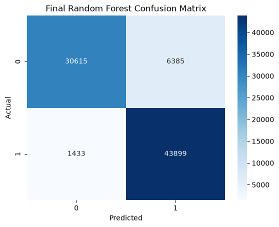
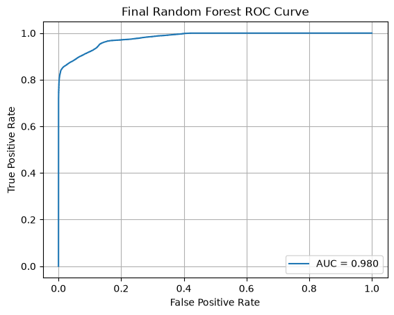
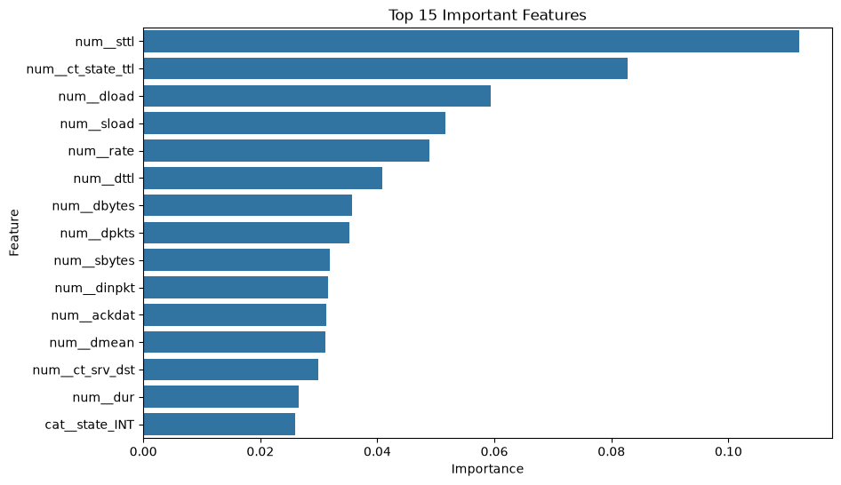

# Network Intrusion Detection Using Machine Learning

## Overview

This project implements a machine learning-based network intrusion detection system using the **UNSW-NB15 cybersecurity dataset**.

The objective is to classify network traffic as either **normal traffic** or **malicious traffic** by analyzing network flow characteristics and applying supervised machine learning algorithms.

The project follows a complete machine learning workflow:

* Exploratory Data Analysis
* Data preprocessing
* Feature engineering
* Model training
* Model evaluation
* Hyperparameter optimization
* Final model selection and evaluation

---

# Dataset

Dataset used:

**UNSW-NB15 Network Intrusion Dataset**

Dataset source:

https://research.unsw.edu.au/projects/unsw-nb15-dataset

The dataset contains network traffic records with features describing communication behavior, including:

* Protocol information
* Service type
* Connection state
* Packet statistics
* Byte transfer information
* Traffic timing characteristics
* Network flow behavior

The task was formulated as a binary classification problem:

| Label | Meaning        |
| ----- | -------------- |
| 0     | Normal traffic |
| 1     | Attack traffic |

---

# Project Structure

```
Network-Intrusion-Detection-ML/

│
├── assets/
│   ├── final_confusion_matrix.png
│   ├── final_roc_curve.png
│   └── final_feature_importance.png
│
├── data/
│   ├── raw/
│   └── processed/
│
├── models/
│   ├── preprocessor.pkl
│   └── final_random_forest.pkl
│
├── notebooks/
│   ├── 01_Data_Exploration.ipynb
│   ├── 02_Data_Preprocessing.ipynb
│   ├── 03_Model_Training.ipynb
│   ├── 04_Model_Evaluation.ipynb
│   ├── 05_Hyperparameter_Tuning.ipynb
│   └── 06_Final_Model_Evaluation.ipynb
│
├── .gitignore
├── requirements.txt
└── README.md
```

---

# Machine Learning Pipeline

## 1. Data Exploration

Exploratory data analysis was performed to understand:

* Dataset structure
* Feature distributions
* Attack category distribution
* Class balance
* Missing values
* Categorical and numerical features

---

## 2. Data Preprocessing

The following preprocessing steps were applied:

* Removed unnecessary `id` feature
* Removed `attack_cat` to prevent target leakage
* Separated features and target labels
* Applied StandardScaler to numerical features
* Applied OneHotEncoder to categorical features
* Created a reusable preprocessing pipeline
* Saved preprocessing components for future inference

---

# Models Implemented

Multiple machine learning algorithms were trained and evaluated.

## Logistic Regression

Used as a baseline classification model.

Accuracy:

```
81.0%
```

---

## Decision Tree

A tree-based classifier capable of learning nonlinear decision boundaries.

Accuracy:

```
86.4%
```

---

## Random Forest

An ensemble model combining multiple decision trees to improve prediction performance.

Accuracy:

```
87.1%
```

---

## Optimized Random Forest

Hyperparameter tuning was performed using **RandomizedSearchCV**.

Best parameters:

```text
n_estimators = 300
max_depth = 10
min_samples_split = 5
class_weight = balanced
```

---

# Model Comparison

| Model                       |  Accuracy | Attack Recall |   ROC-AUC |
| --------------------------- | --------: | ------------: | --------: |
| Logistic Regression         |     81.0% |           97% |         - |
| Decision Tree               |     86.4% |           96% |         - |
| Random Forest               |     87.1% |           98% |     0.978 |
| **Optimized Random Forest** | **90.5%** |       **97%** | **0.980** |

The optimized Random Forest model was selected as the final model due to its improved overall performance.

---

# Final Model Performance

The final optimized Random Forest classifier achieved:

| Metric           | Score |
| ---------------- | ----: |
| Accuracy         | 90.5% |
| Attack Precision |   87% |
| Attack Recall    |   97% |
| Attack F1-score  |   92% |
| ROC-AUC          | 0.980 |

The high recall value is especially important for intrusion detection systems because it indicates that the model successfully identifies the majority of malicious network traffic.

---

# Final Model Evaluation

The final model was evaluated using:

* Confusion Matrix
* ROC Curve
* ROC-AUC Score
* Feature Importance Analysis

## Confusion Matrix

The confusion matrix shows the classification performance of the final optimized Random Forest model.



---

## ROC Curve

The ROC curve demonstrates the model's ability to distinguish between normal and malicious network traffic.



---

## Feature Importance

Feature importance analysis was performed to identify the network characteristics that contribute most to intrusion detection.



---

# Technologies Used

* Python
* Pandas
* NumPy
* Scikit-learn
* Matplotlib
* Seaborn
* Joblib
* Jupyter Notebook

---

# Installation

Clone the repository:

```bash
git clone https://github.com/ErandiTharushika/Network-Intrusion-Detection-ML.git
```

Navigate to the project directory:

```bash
cd Network-Intrusion-Detection-ML
```

Install dependencies:

```bash
pip install -r requirements.txt
```

---

# Future Improvements

Possible future extensions:

## Multi-class Attack Classification

Instead of binary classification, classify individual attack categories:

* DoS
* Exploits
* Reconnaissance
* Fuzzers
* Worms
* Shellcode
* Backdoor

---

## Real-Time Intrusion Detection Dashboard

Develop a real-time monitoring dashboard using:

* Streamlit
* Flask
* FastAPI

---

## Advanced Machine Learning Models

Compare performance with:

* XGBoost
* LightGBM
* Neural Networks
* Deep Learning-based intrusion detection models

---

## Deployment

Deploy the trained model as an API service for real-time network traffic classification.

---

# Author

**Erandi Tharushika**

Electronic and Telecommunication Engineering
University of Moratuwa
